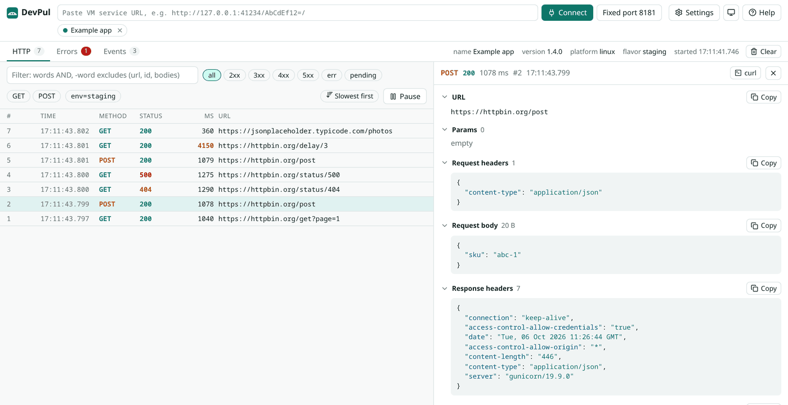

# DevPul

Debug bridge between a running Dart or Flutter app and your browser. The app sends HTTP calls, errors, logs, routes and custom events; the browser shows them live. No proxy, no certificates, no server. Pul means bridge in Nepali.

**Open the UI: [devpul.saradgajurel.com.np](https://devpul.saradgajurel.com.np)**

<picture>
  <source media="(prefers-color-scheme: dark)" srcset="docs/screenshot-dark.png">
  
</picture>

Everything runs in your browser. Requests, headers and bodies go from your app to the DevPul tab over `127.0.0.1` and are never sent to a server.

**Docs: [getting started](https://devpul.saradgajurel.com.np/docs/), [connecting](https://devpul.saradgajurel.com.np/docs/connecting/), [using the UI](https://devpul.saradgajurel.com.np/docs/ui/), [extending](https://devpul.saradgajurel.com.np/docs/extend/), [plugins](https://devpul.saradgajurel.com.np/docs/plugins/), [help and FAQ](https://devpul.saradgajurel.com.np/help/).** The same pages are in [app/pages](app/pages).

## How it works

The app posts events with `dart:developer` `postEvent`. They travel on the VM service Extension stream that every debug run already has. The browser connects to the Dart Development Service (DDS) websocket on `127.0.0.1` and reads them. Release and profile builds have no VM service, and DevPul never emits in them.

Works with Flutter on Android, iOS, desktop and web, and with plain Dart programs. Any state management through [observers](https://devpul.saradgajurel.com.np/docs/extend/), any HTTP client through adapters.

## Quick start

1. Add the packages:

   ```yaml
   dependencies:
     devpul: ^0.2.0
     devpul_dio: ^0.2.0      # Dio
     devpul_http: ^0.2.0     # package:http
     devpul_flutter: ^0.2.0  # Flutter errors, debugPrint and routes
   ```

2. Hook them up:

   ```dart
   void main() {
     DevpulFlutter.install();
     Devpul.session({'name': 'My app', 'version': '1.0.0', 'flavor': 'dev'});
     dio.interceptors.add(DevpulDioInterceptor());
     runApp(MaterialApp(navigatorObservers: [DevpulNavigatorObserver()], home: const Home()));
   }
   ```

3. Run the app with `flutter run`, open [DevPul](https://devpul.saradgajurel.com.np) and paste the VM service URL the run prints, for example `http://127.0.0.1:41234/AbCdEf12=/`.

The [example app](examples/devpul_example) uses every package.

## Packages

| Package | What it does |
| --- | --- |
| [devpul](packages/devpul) | Pure Dart core: `Devpul.session`, `tags`, `emit`, `log`, `error`, `action`, config, `DevpulHttp` for adapters. Web compatible. |
| [devpul_dio](packages/devpul_dio) | `DevpulDioInterceptor` for Dio. |
| [devpul_http](packages/devpul_http) | `DevpulClient` for package:http. |
| [devpul_flutter](packages/devpul_flutter) | Flutter errors with diagnostics, `debugPrint` capture, `DevpulNavigatorObserver`. |
| [devpul (npm)](launcher) | `npx devpul` serves the UI on 127.0.0.1. |

## In the browser

- HTTP table with live pending rows, sortable columns, a filter syntax (`status:4xx ms:>500 host:api -word`), JSON trees, copy as curl or fetch, HAR export.
- Errors with stack traces and Flutter diagnostics, grouped by repeat, with the requests made just before.
- Logs, custom events, app actions you trigger from the UI, and plugins for your own tabs.
- Several apps at once, history across reloads, session files to share, keyboard navigation.

## Limits

- Debug builds only, by design.
- Events cross the VM service as JSON. Very large or very frequent events cost app memory and time; `maxValueLength`, `backlogSize` and `ignoreUrls` keep that bounded.
- Configuration does not cross isolates.
- No request replay or mocking.

## Development

```sh
flutter pub get
dart analyze --fatal-infos
(cd packages/devpul && dart test && dart test -p chrome)
(cd packages/devpul_dio && dart test)
(cd packages/devpul_http && dart test)
(cd packages/devpul_flutter && flutter test)

npm install
npm run dev      # UI on http://localhost:5173
npm run check    # oxlint, vitest, tsc, build
```

The site URL and repository link live in `app/site.json`. Docs are markdown in `app/pages`, rendered to static pages by the build and by the dev server. `npm run deploy` builds the UI and publishes `app/dist` to the `gh-pages` branch.

## License

MIT
